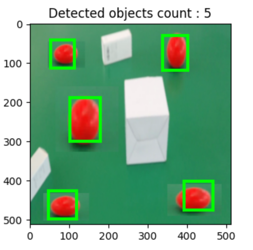

# 基于YOLOv2的目标检测

## 功能介绍

- PKUAIP数据集转换（txt -> xml格式）
- 模型训练
- 目标检测

## Requirements

- python 3
- tensorflow 2.x

- tqdm
- cv2

## 目录说明

```bash
data/ # 存放数据集和标签
logs/ # 日志
test_img/ # 从val集随便抽取的测试图片，部分图片经过加工，增加了红球的数量
utils/ # 数据集转换、模型构架、数据集加载、利用模型进行预测的核心函数
weights/ # 存放训练过程中的weights，每迭代一轮都会只保留目前best weights文件
config.py # 配置文件
train.py # 按照配置文件定义的参数加载数据集，加载模型，定义loss函数，训练模型
test.py # 加载指定的weights，输入图片地址可以进行预测
yolo_pretrained.weights # yolo预训练模型
weights_best_of_100_epochs.h5 # 训练100次得到的最佳模型

新增：
weights_best_of_100_epochs.h5     # 训练500次得到的模型
PKUAIP/   		 # 原始数据集，需要手动放入，计算map时需要用到其中的原始标签
test_map.py		 # 在测试集上生成预测值，并从 PKUAIP/ 中拷贝真实值。结果存储在 map/ 中
map/             # 存放模型预测值和真实值，运行 test_map.py 后自动生成
	map/gt/      # 测试集真实值
	map/dr/      # 测试集预测值
map.py           # 计算 map 的主函数
result/          # map 的计算结果，由 map.py 生成
```

## 使用步骤

1. 准备数据集

   将PKUAIP数据集的`images`和`labels`文件夹拷贝到`data`目录下，在`utils`目录下运行`dataset_transfer.py`，自动做以下工作：

   - 将image边长resize为(512, 512)
   - 将数据集按照0.2的ratio分为train和val两部分，并且移除没有标签的图片，同时根据`SHUFFLE_SEED=108`进行shuffle
   - 根据txt标签生成xml标签

   处理后的数据集在：

   ```python
   train_image_folder = 'data/train/image/'
   train_annot_folder = 'data/train/annotation/'
   val_image_folder = 'data/val/image/'
   val_annot_folder = 'data/val/annotation/'
   ```

2. 模型训练

   直接运行`train.py`，即可按照`config.py`指定的参数进行训练。训练后的参数保存在`weights`文件夹。

3. 预测

   在`test.py`中指定要加载的weights文件路径，运行`test.py`，按照提示输入图片路径即可进行预测。



4. 计算 map

    - 第一步：将 PKUAIP数据集拷贝到 `./` 目录下，并命名为 `PKUAIP/`
    - 第二步：运行 `test_map.py`，将生成 `map/gt/` 和 `map/dr/` 两个文件，分别存储了测试集的真实结果和模型预测结果
    - 第三步：运行 `map.py`，将生成 `results/` 文件，得到 map、recall、precision等结果和可视化图片

    